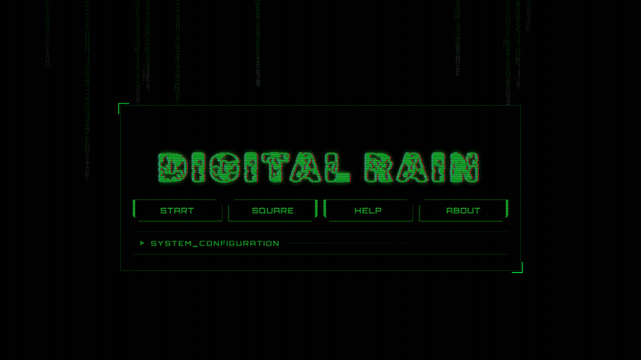

# Digital Rain Project

Animated Matrix/Ghost in the Shell-inspired digital rain built with Svelte, TypeScript, and Canvas.

[Live Demo](https://mattbunch.dev/digital-rain)



## Features

- Canvas-rendered digital rain animation with normal and square modes.
- Menu-driven controls for color, speed, intensity, font size, character set, and direction.
- Keyboard controls for fast live changes while the animation is running.
- Disco mode, wave distortion, mouse interaction fields, and per-string color effects.
- Built-in presets plus saved custom presets in local storage.

## Controls

- Arrow keys: Switch directions or move the box in Square Mode
- Spacebar: Pause
- C: Clear screen
- D: Toggle disco
- W/S: Increase or decrease font size
- X: Toggle wave distortion
- Q/A: Increase or decrease string length
- R: Toggle rapid word change
- M: Switch between modes
- T: Toggle all 4 directions
- Y/U/B/N: Diagonal directions
- PageUp/PageDown: Speed up or slow down
- 1-7: Change colors
- 8: Random color
- Escape: Quit to menu

## Presets

Use the `SYSTEM_CONFIGURATION` panel to select built-in presets, adjust settings, and save custom presets. Custom presets are stored locally in the browser.

## Development

Install dependencies:

```bash
npm ci
```

Run locally:

```bash
npm run dev
```

Build:

```bash
npm run build
```

Linting:

```bash
npm run lint
```

Tests:

```bash
npm run test
npm run test:e2e
```

Regenerate the README demo:

```bash
npm run demo:record
```

## Roadmap

- see docs/project_feature_ideas_and_improvements.md
  - point 8 - instructions are in docs/phosphor_glow_plan.md - can't do this
  - point 9 - remove 8 directions functionality from codebase - get Gemini to do this, Codex messes it up.
  - point 10 - can't tell any difference - stashed
- Colour wheel selector.

### Deployment

- deployment, cicd pipeline, personal website.
  - matt-bunch-dev.com - astro.js landing page, links (typical developer portfolio website, links to projects)
  - matt-bunch-dev.com/digital-rain - this application is at this url

### UI bugfixes, effects

- move square mode - matrix strings don't "hang" in place.
- w/s keys, q/r keys - resets screen
- remove commented out console logging from button & settings menu
- slight component/screen shake on pressing button or input.
- cool cyberpunk television transition effect when switching from "menu" to "digital rain canvas" view - very quick, 200ms - 400 ms max
- adapt matrix string values to work with any size monitor for consistent views no matter the screen size

## Misc

The core of this program was written while I was learning JS, mostly completed on 18/08/20 and 19/08/20. Then on April 29 2026, I started the process of rewriting and modernizng this program in Node.js with TypeScript, with the help of AI tools such as Gemini CLI and Codex CLI to expediate the process.

I had completed another Digital Rain animation program in Java previously, which serves as a prototype of this current program.
